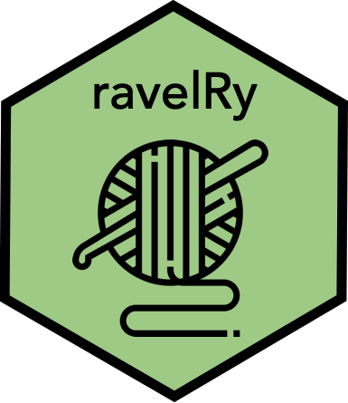

# ravelRy 

<!-- badges: start -->

[](https://travis-ci.org/walkerkq/ravelRy)
<!-- badges: end -->

ravelRy is an R package that provides access to the [Ravelry
API](https://www.ravelry.com/groups/ravelry-api).

[Ravelry](https://www.ravelry.com/about) describes itself as *a place
for knitters, crocheters, designers, spinners, weavers and dyers to keep
track of their yarn, tools, project and pattern information, and look to
others for ideas and inspiration.*

Hex sticker yarn icon by
[Eucalyp](https://www.flaticon.com/authors/eucalyp) via Flaticon.

## Installation

You can install the development version of ravelRy from Github with:

``` r
devtools::install_github("walkerkq/ravelRy")
```

## Getting started

1.  Set up a Ravelry developer account at
    <https://www.ravelry.com/pro/developer>.  
2.  Create an app with basic authentication: read only access.  
3.  Set `RAVELRY_USERNAME` and `RAVELRY_PASSWORD` in your .renviron file
    or via the console with the `ravelry_auth()` function.

<!-- end list -->

``` r
library(ravelRy)

ravelry_auth(key = 'username')
ravelry_auth(key = 'password')
```

### An example

Retrieve a list of free patterns for baby hats.

``` r
library(ravelRy)

search_results <- search_patterns(query = 'hat', page_size = 5, availability = 'free', fit = 'baby')
search_results
#> # A tibble: 5 x 7
#>   free      id name    permalink  designer.id designer.name pattern_sources
#>   <lgl>  <int> <chr>   <chr>            <int> <chr>         <list>         
#> 1 TRUE  124400 Sockhe… sockhead-…       21767 Kelly McClure <df[,59] [3 × …
#> 2 TRUE  464893 Garter… garter-ea…       40686 Purl Soho     <df[,59] [1 × …
#> 3 TRUE  991743 Done i… done-in-o…       57164 Jennifer Pio… <df[,59] [2 × …
#> 4 TRUE  528611 Classi… classic-c…       40686 Purl Soho     <df[,59] [2 × …
#> 5 TRUE  585110 Quick … quick-omb…       82906 Emily Dormier <df[,59] [1 × …
```

Get pattern details for those ids.

``` r
patterns <- get_patterns(ids = search_results$id)
patterns
#> # A tibble: 5 x 50
#>   comments_count created_at currency difficulty_aver… difficulty_count
#>            <int> <chr>      <chr>               <dbl>            <int>
#> 1            156 2009/05/2… ""                   1.52             4887
#> 2             89 2014/01/2… "USD"                2.41             2449
#> 3             23 2014/10/2… "USD"                1.84             1158
#> 4             76 2015/06/0… ""                   2.21              712
#> 5              1 2020/01/0… "USD"                2.25                4
#> # … with 45 more variables: downloadable <lgl>, favorites_count <int>,
#> #   free <lgl>, gauge <chr>, gauge_divisor <int>, gauge_pattern <chr>,
#> #   generally_available <chr>, id <int>, name <chr>, pdf_url <chr>,
#> #   permalink <chr>, price <chr>, projects_count <int>, published <chr>,
#> #   queued_projects_count <int>, rating_average <dbl>, rating_count <int>,
#> #   row_gauge <chr>, updated_at <chr>, url <chr>, yardage <int>,
#> #   yardage_max <int>, personal_attributes <chr>, sizes_available <chr>,
#> #   product_id <chr>, currency_symbol <chr>, ravelry_download <lgl>,
#> #   download_location <list>, pdf_in_library <lgl>,
#> #   volumes_in_library <chr>, gauge_description <chr>,
#> #   yarn_weight_description <chr>, yardage_description <chr>,
#> #   pattern_needle_sizes <list>, notes_html <chr>, notes <chr>,
#> #   packs <list>, printings <list>, yarn_weight <list>, craft <list>,
#> #   pattern_categories <list>, pattern_attributes <list>,
#> #   pattern_author <list>, photos <list>, pattern_type <list>
```

More examples can be found
[here](https://github.com/walkerkq/ravelRy/tree/master/man/example_files/example_eda.md).
