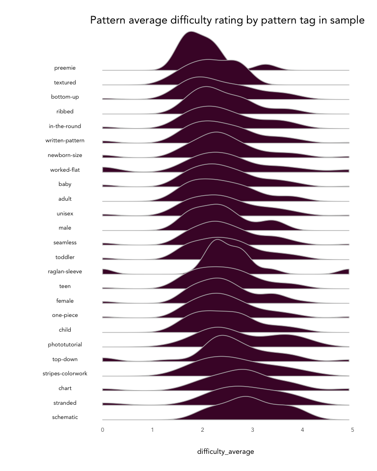

Example Data Exploration with ravelRy
================

``` r
knitr::opts_chunk$set(echo = TRUE, fig.width = 6, fig.height = 4)
library(ravelRy)
library(tidyverse)
source('../../../kp_themes/theme_kp.R')
theme_set(theme_classic() + theme_kp())
```

### Patterns

Start by retrieving a sample of patterns for babies and their details.

``` r
patterns <- search_patterns(page_size = 100, fit = 'baby')
pattern_details <- get_patterns(ids = patterns$id)
```

Top 10 designers by pattern count in sample:

``` r
patterns %>%
  group_by(designer.name) %>%
  count() %>%
  ungroup() %>%
  arrange(desc(n)) %>%
  slice(1:10)
```

    ## # A tibble: 10 x 2
    ##    designer.name         n
    ##    <chr>             <int>
    ##  1 tincanknits          25
    ##  2 Anna Dervout          4
    ##  3 Purl Soho             4
    ##  4 PetiteKnit            3
    ##  5 Andrea Mowry          2
    ##  6 DMC                   2
    ##  7 Emily Dormier         2
    ##  8 Helen Stewart         2
    ##  9 Kelly van Niekerk     2
    ## 10 Lisa Chemery          2

Look at the density of comments based on the cost of the pattern:

``` r
pattern_details %>%
  ggplot(aes(x = comments_count, fill = free)) +
  geom_density(alpha = 0.7) +
  labs(title = 'Comment count by free/paid in sample') +
  scale_fill_kp()
```

<!-- -->

Unnest two columns and take a count:

``` r
pattern_details %>%
  unnest(craft, names_sep = '_') %>% 
  unnest(pattern_type, names_sep = '_') %>% 
  group_by(craft_name, pattern_type_name) %>%
  count() %>%
  ggplot(aes(x = reorder(pattern_type_name, n, sum), y = n, fill = craft_name)) +
  geom_col() +
  labs(title = 'Pattern type by craft in sample',
       x = 'pattern_type_name') +
  scale_fill_kp()
```

<!-- -->

### Yarn

Start by retrieving a sample of yarns and their details.

``` r
yarns <- search_yarn(page_size = 100, sort = 'projects', fiberc = '2')
yarn_details <- get_yarns(ids = yarns$id)
```

Get the top rated yarns in the sample:

``` r
yarns %>%
  arrange(desc(rating_average)) %>%
  select(id, name, rating_average) %>%
  slice(1:5)
```

    ## # A tibble: 5 x 3
    ##       id name                           rating_average
    ##    <int> <chr>                                   <dbl>
    ## 1  14645 Artisan Sock                             4.79
    ## 2 118765 Twist Light                              4.77
    ## 3 100150 Alegría                                  4.75
    ## 4  11111 Silk Cloud                               4.74
    ## 5  53523 Handgefärbte Sockenwolle 4fach           4.7

How do fiber types appear together in yarn?

``` r
# get the top 10 fiber types 
top_fiber_types <- yarn_details %>%
  unnest(yarn_fibers, names_sep = '_') %>%
  count(yarn_fibers_fiber_type.name) %>%
  filter(n > 5) %>%
  arrange(desc(n)) %>%
  slice(1:10)

# unnest the yarn_fibers column, bucket fiber names, and spread wide
yarn_fibers_wide <- yarn_details %>% 
  unnest(yarn_fibers, names_sep = '_') %>%
  mutate(yarn_fiber_name = ifelse(yarn_fibers_fiber_type.name %in% top_fiber_types$yarn_fibers_fiber_type.name,
                                  yarn_fibers_fiber_type.name,
                                  'Other')) %>%
  pivot_wider(id_cols = 'id', 
              names_from = 'yarn_fiber_name', 
              values_from = 'yarn_fibers_percentage', 
              values_fn = list(yarn_fibers_percentage = sum)) 

# compute correlation and plot
yarn_fibers_wide %>%
  select(-id) %>%
  mutate_if(is.numeric, function(x) ifelse(is.na(x), 0, 1)) %>%
  cor() %>%
  corrplot::corrplot(type = 'upper', 
                     method = 'color', 
                     order = 'hclust', 
                     tl.col = 'black', 
                     addCoef.col = 'black',
                     number.cex = 0.6,
                     col = colorRampPalette(colors = c(
                       kp_cols('red'), 
                       'white', 
                       kp_cols('dark_blue')))(200),
                     mar = c(2,2,2,2),
                     main = 'Yarn Fiber Correlation',
                     family = 'Avenir')
```

<!-- -->

How do pattern tags associate with difficulty?

``` r
pattern_details_attributes <- pattern_details %>%
  unnest(cols = 'pattern_attributes', names_sep = '_') 

top_attributes <- pattern_details_attributes %>%
  filter(difficulty_count >= 15) %>%
  count(pattern_attributes_permalink) %>%
  filter(n >= 10)

attributes_long <- pattern_details_attributes %>% 
  filter(pattern_attributes_permalink %in% top_attributes$pattern_attributes_permalink) %>%
  select(id, pattern_attributes_permalink, difficulty_average) 

attributes_long %>%
  ggplot() +
  geom_density(aes(x = difficulty_average), fill = '#490B32', color = 'grey') +
  facet_grid(reorder(pattern_attributes_permalink, difficulty_average, median)~.,switch = 'y') +
  labs(title = 'Pattern average difficulty rating by pattern tag in sample',
       y = '', x = 'difficulty_average') +
  theme_kp() +
  theme(panel.spacing = unit(-3, "lines"),
        panel.grid.major.y = element_blank(),
        strip.text.y = element_text(angle = 180, vjust = 0),
        strip.background = element_rect(fill = NA, color = NA),
        axis.text.y = element_blank())
```

<!-- -->
