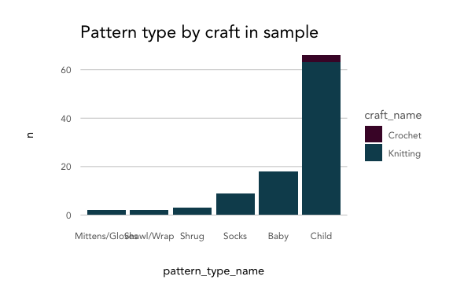

Example Data Exploration with ravelRy
================

``` r
knitr::opts_chunk$set(echo = TRUE, fig.width = 6, fig.height = 4)
library(ravelRy)
library(tidyverse)
source('../../../kp_themes/theme_kp.R')
theme_set(theme_classic() + theme_kp())
```

### Patterns

Start by retrieving a sample of patterns for babies and their details.

``` r
patterns <- search_patterns(page_size = 100, fit = 'baby')
pattern_details <- get_patterns(ids = patterns$id)
```

Top 10 designers by pattern count in sample:

``` r
patterns %>%
  group_by(designer.name) %>%
  count() %>%
  ungroup() %>%
  arrange(desc(n)) %>%
  slice(1:10)
```

    ## # A tibble: 10 x 2
    ##    designer.name         n
    ##    <chr>             <int>
    ##  1 tincanknits          26
    ##  2 PetiteKnit            5
    ##  3 Purl Soho             4
    ##  4 Anna Dervout          3
    ##  5 Andrea Mowry          2
    ##  6 DMC                   2
    ##  7 Emily Dormier         2
    ##  8 Helen Stewart         2
    ##  9 Kelly van Niekerk     2
    ## 10 Lisa Chemery          2

Look at the density of comments based on the cost of the pattern:

``` r
pattern_details %>%
  ggplot(aes(x = comments_count, fill = free)) +
  geom_density(alpha = 0.7) +
  labs(title = 'Comment count by free/paid in sample') +
  scale_fill_kp()
```

<!-- -->

Unnest two columns and take a count:

``` r
pattern_details %>%
  unnest(craft, names_sep = '_') %>% 
  unnest(pattern_type, names_sep = '_') %>% 
  group_by(craft_name, pattern_type_name) %>%
  count() %>%
  ggplot(aes(x = reorder(pattern_type_name, n, sum), y = n, fill = craft_name)) +
  geom_col() +
  labs(title = 'Pattern type by craft in sample',
       x = 'pattern_type_name') +
  scale_fill_kp()
```

<!-- -->

### Yarn

Start by retrieving a sample of yarns and their details.

``` r
yarns <- search_yarn(page_size = 100)
yarn_details <- get_yarns(ids = yarns$id)
```

Get the top rated yarns in the sample:

``` r
yarns %>%
  arrange(desc(rating_average)) %>%
  select(id, name, rating_average) %>%
  slice(1:5)
```

    ## # A tibble: 5 x 3
    ##      id name         rating_average
    ##   <int> <chr>                 <dbl>
    ## 1 54983 Pashmina               4.81
    ## 2 62569 Rios                   4.8 
    ## 3 55637 Tosh Vintage           4.8 
    ## 4 46836 Rasta                  4.8 
    ## 5 74654 Arroyo                 4.79

How do fiber types appear together in yarn?

``` r
yarn_details %>%
  unnest(yarn_fibers, names_sep = '_') %>%
  pivot_wider(id_cols = 'id', names_from = 'yarn_fibers_fiber_type.name', values_from = 'yarn_fibers_percentage') %>%
  select(-id) %>%
  mutate_if(is.numeric, function(x) ifelse(is.na(x), 0, x)) %>%
  cor() %>%
  corrplot::corrplot(type = 'upper', 
                     method = 'color', 
                     order = 'hclust', 
                     tl.col = 'black', 
                     addCoef.col = 'black',
                     number.cex = 0.6,
                     col = colorRampPalette(colors = c(
                       kp_cols('red'), 
                       'white', 
                       kp_cols('dark_blue')))(200),
                     main = 'Yarn Fiber Correlation',
                     mar = c(2,2,2,2),
                     family = 'Avenir')
```

<!-- -->
